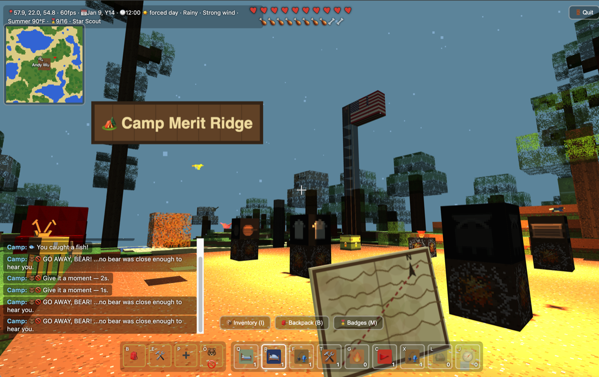

# ScoutCraft



Welcome to **Camp Merit Ridge** — set up camp in the wilderness and earn your merit badges. A single-player voxel world that runs
entirely in the browser — procedurally generated terrain, block breaking/placing, crafting — built
with [three.js](https://threejs.org/) — with a scouting layer on top: rope you twist from leaves, a
walk-in tent you pitch, campfires you cook on, a compass that finds its way back to camp, and
eighteen merit badges that promote you from Scout to Eagle Scout.

No build step, no server-side code, no dependencies to install, no account to make. Everything —
your world, your inventory, your progress — lives in this browser's `localStorage`.

ScoutCraft began as a fork of [Blockcraft](../blockcraft) and keeps its whole engine: the same
terrain generation, chunked meshing, day/night cycle, seasons and weather, animals, birds, fish and
wildlife. What's new is everything in [Merit badges](#merit-badges) and [Camp gear](#camp-gear).

Built by Andre Wu, his dad, and an AI to help others discover scouting! Andre scouts with Troop 904
out of Dublin, CA, USA. If you had fun, please consider supporting his scouting adventures and our
heroes: [🍿 Andre's Popcorn Sale](https://trails-end.com/store/scout/HQ9SW6MR).

## Play locally

Open `index.html` directly, or serve the folder (recommended, since some browsers restrict features on `file://`):

```bash
python3 -m http.server 8000
```

Then visit `http://localhost:8000`.

## Deploy to GitHub Pages

1. Create a new GitHub repository (public).
2. Push this folder's contents (`index.html`, `main.js`, `assets/`) to the repo's default branch:
   ```bash
   git init
   git add index.html main.js assets README.md
   git commit -m "Add ScoutCraft"
   git branch -M main
   git remote add origin https://github.com/<your-username>/<your-repo>.git
   git push -u origin main
   ```
3. In the repo, go to **Settings → Pages**.
4. Under **Build and deployment → Source**, choose **Deploy from a branch**.
5. Set **Branch** to `main` and folder to `/ (root)`, then **Save**.
6. After a minute or two, your game is live at:
   `https://<your-username>.github.io/<your-repo>/`

## Controls

- `WASD` — move
- `Space` — jump
- `Shift` — sprint
- Mouse — look (click the page first to lock the pointer)
- Left click — break block, or attack whatever animal/player you're looking at within range
- Right click — place block. Or, depending on what you're holding and what you're aiming at: take a bearing with the Compass, cast a Fishing Pole into water, collect a golden Scout Law box, open the Camp Workbench or a placed Backpack, toggle a window/door open or closed, or light a fire with Flint aimed at wood or leaves
- `Q` `R` `F` `T` `G` `C` `X` `L` `J` — select a hotbar slot directly (no number keys, no scroll-wheel cycling)
- `I` (or click the currently-selected hotbar slot again, or the **📦 Inventory (I)** button) — open your inventory and choose what that slot holds
- `B` (or the **🎒 Backpack (B)** button, or the fixed **🎒** quick-access icon) — open your Backpack's own storage directly, without needing to find or place one first
- `E` (or the fixed **🛠️** quick-access icon) — open/close crafting when standing near a Camp Workbench
- `M` (or the **🎖️ Badges (M)** button) — open your merit badge sash
- `K` — sleep through the night to 7am, if you're near your tent, it's after dark, and your Sleeping Bag and Sleeping Pad are out of your Backpack
- `V` — toggle first-person view (third-person, seeing your own blocky character, is the default)
- `P` (or the fixed **➕** quick-access icon) — First Aid: an instant 2-heart heal, once every 10 seconds
- `O` (or the fixed **🐻🚫** quick-access icon) — Stop Bear: see [Health & combat](#health--combat)
- `H` — toggle the hotkey list, a panel on the right edge of the screen listing every key above (and this one). Hidden by default so it doesn't clutter the screen; the front-page tutorial still covers the basics before you even start playing.
- The **❓ How to play** button on the start screen reveals the full tutorial paragraph (chopping trees, crafting, badges) — collapsed by default so the front page stays short; click it again (now **✕ Hide help**) to put it away.
- The **🏅 Share My Achievements** button (top-right corner) — shows a thank-you screen with a link to support Andre's troop's popcorn sale. Nothing is lost by clicking it — your world, inventory, and badges are already saved continuously as you play — and "Keep playing instead" puts it away again with no other side effects.
- Closing the tab or navigating away without clicking it first triggers the browser's own "Leave site?" confirmation instead — a browser won't let a page show its own custom screen at that exact moment, so this is the closest real equivalent, just enough of a pause to reconsider. It only fires once; if you've already seen the actual thank-you screen, closing from there doesn't prompt twice.
- That same thank-you screen can also share the game itself — Facebook, X, Instagram, Message, and Email buttons, plus a native **Share…** button on phones/browsers that support one. Every link carries the game's own URL and a one-line brag about your current rank and merit badges (skipped if you haven't earned one yet), regenerated fresh each time you open it so it's never stale. Instagram has no actual "share a link" page the way the others do, so on a phone it hands off to the same native share sheet (which lists Instagram as one of its targets); everywhere else it copies the text so you can paste it into a post or story yourself.
- The thank-you screen also draws a shareable badge picture on the spot — your current rank plus all 18 merit badges, earned ones lit up in gold and the rest dimmed, regenerated fresh every time you open it just like the text above. On a phone, **Share…** and **Instagram** attach it directly through the native share sheet wherever that's supported; everywhere else, hit **🖼️ Save Image** to download it and attach it by hand, since Facebook, X, and Email's own links have no way to carry a file.

The front page says so directly, but worth repeating here too: ScoutCraft is designed for a desktop or laptop with a real keyboard and mouse — that's where every control above actually applies. On a phone or tablet (iPad included), the game automatically switches to touch controls instead — no setup needed, just open the page in Safari and tap to play — but that's a fallback, not the intended experience:

- Left thumb: on-screen joystick to move (push all the way to the edge to sprint)
- Right side of the screen: drag to look around
- ⛏ — break / attack, ▦ — place / interact (open a table, toggle a window or door, light a fire), **JUMP**, **3rd** — third-person camera
- Tap a hotbar slot to select it, tap it again (or the **📦 Inventory (I)** button) to change what it holds

## Inventory & hotbar

Your inventory — everything you're currently holding, with live counts — is saved to this browser. Open it with `I`, the **📦 Inventory (I)** button, or by clicking a hotbar slot that's already selected. It's split into what you actually have ("Your items", with a count on each) and everything else you could still obtain or craft ("Not yet obtained", grayed out) — tap any tile, held or not, to put it in the currently-selected hotbar slot.

The hotbar itself only shows 9 slots (keys `Q` `R` `F` `T` `G` `C` `X` `L` `J`, one per slot, left to right) at a time, but any slot can hold any item in the game — materials, structures, tools, all reachable from the same inventory screen. Your hotbar layout is saved per-browser, so it's exactly how you left it next time.

Four more icons sit fixed to the hotbar's left — Backpack, Camp Workbench, First Aid, and Stop Bear — always the same four actions rather than slots you can put items into:

- **🎒 Backpack** (`B`)
- **🛠️ Camp Workbench** (`E`) — opens crafting if you're within 4 blocks of a placed Camp Workbench, otherwise just says so
- **➕ First Aid** (`P`) — an instant heal of 2 hearts, once every 10 seconds — an active option alongside the passive stand-still regen, not a replacement for it
- **🐻🚫 Stop Bear** (`O`) — see [Health & combat](#health--combat) below

Every one of the four also has a keyboard shortcut, shown as a small letter in its corner — they work identically whether you click the icon or press the key.

## Crafting

Blocks you break go into your inventory (shown as counts on the hotbar), and placing a block spends one from it. Place a Camp Workbench on the ground, then right-click it (or stand nearby and press `E`) to open the crafting menu:

**Basics**

- 1 Wood → 4 Planks
- 2 Planks → 4 Sticks
- 4 Planks → 1 Camp Workbench
- 1 Stick + 1 Flint → 2 Torches

**Camp gear**

- 4 Leaves → 2 Rope
- 3 Wood + 1 Flint → 1 Campfire
- 1 Stick + 1 Flint → 1 Lantern
- 2 Planks + 2 Sticks + 1 Rope → 1 Troop Flag
- 2 Sticks + 1 Rope → 1 Fishing Pole

Bricks, Windows, Doors, Ladders, Flint, Tents, Compasses and Backpacks are no longer craftable —
Flint, Tents, Compasses and Rope come pre-packed in your Backpack instead (see
[Camp gear](#camp-gear) below), Backpack storage itself is always one press of `B` away with no
block needed, and the rest were generic building blocks with no real tie to scouting. Rope keeps
its own recipe on top of the head start your Backpack gives you, since the Troop Flag and Fishing
Pole still need a fresh supply — so finding a tree remains a scout's first real job.

The Craft button lights up once you have enough materials. Your inventory (like your world edits) is saved to `localStorage`, so it persists across reloads.

## Merit badges

The scouting layer on top of the sandbox. Instead of only building for its own sake, you earn
badges for doing real scout things, and badges promote you through the ranks. Press `M` (or the
**🎖️ Badges (M)** button) to open your sash: earned badges are lit in gold, the rest show what they
want and how far along you are ("14 / 25 wood").

| Badge | Name | How to earn it |
| --- | --- | --- |
| 🪵 | Woodcraft | Gather 25 wood from trees |
| 🪢 | Pioneering | Twist 6 lengths of rope |
| 🔥 | Firecraft | Light your first campfire |
| ⛺ | Camping | Pitch a tent |
| 🍳 | Cooking | Cook one dish on every kind of cookware |
| 🧭 | Navigation | Take a bearing with your compass |
| 🥾 | Hiking | Hike 1,000 blocks on foot |
| 🏊 | Swimming | Swim 60 blocks |
| 🧗 | Climbing | Get 18 blocks above sea level |
| 🦌 | Nature Study | Study all 5 animals up close — the bear and moose included |
| 🦉 | Night Watch | Spend 5 minutes outdoors after dark |
| ⛑️ | First Aid | Use your First Aid Kit |
| 🚩 | Troop Flag | Raise your troop flag at camp |
| ⭐ | Astronomy | Find the Big Dipper and stare at it for 10 seconds |
| 🎣 | Fishing | Catch 5 fish |
| 🛶 | Kayaking | Paddle the lake for 30 seconds |
| 🐴 | Horseback Riding | Ride 200 blocks on horseback |
| 🏅 | Scout Spirit | Find all 12 golden Scout Law boxes hidden around camp |

Ranks follow from the count alone — **None** (0, nothing earned yet), **Scout** (1), **Tenderfoot**
(2), **Second Class** (3), **First Class** (6), **Star Scout** (9), **Life Scout** (12), **Eagle
Scout** (14 — just over 3/4 of all 18, not literally every one of them) — and your current rank and
badge count sit in the HUD at the top of the screen. Earning one plays a short bugle call and drops a
banner telling you what you got, and what rank it just made you.

Your rank also shows up as a small original badge icon — a colored disc with one star per tier, not a
copy of any real insignia — in three places: next to your rank on the floating name tag over your
head, stitched onto your shirt's left chest pocket (updates the moment you rank up), and above your
rank name on the achievement card the exit screen generates for sharing.

Progress is per-browser, saved to `localStorage` alongside your world edits and inventory, and only
counts while you're actually playing — nothing accrues while you sit on the start screen or have a
panel open. Distance ignores teleport-sized jumps, so a respawn doesn't quietly hand you Hiking.

Nature Study deliberately tracks only the five ground animals and only within 9 blocks: birds are
spawned to circle wherever the player is and fish fill every pond, so counting them made the badge
free. Walking up to the black bear, on the other hand, is a genuine dare — it attacks on sight.

Scout Spirit is a scavenger hunt for the real Scout Law: 12 small golden boxes, one for each point
(Trustworthy, Loyal, Helpful, Friendly, Courteous, Kind, Obedient, Cheerful, Thrifty, Brave, Clean,
Reverent), scattered across dry land well away from the cooking area, each with its word floating
over it so it reads from a few blocks off. Right-click one to read what it means and collect it —
they're indestructible until then, so there's no way to lose one by accident, and where they're
hidden never changes between visits, only whether you've already found them. Collecting the last one
earns the badge.

## Camp gear

Eight things the badges are built around — some crafted at the workbench, some pre-packed in your
Backpack from the start instead. Break a placed one to pick it back up — for the tent, breaking any
single wall takes the whole shelter down and hands back just one Tent item, not one per block.

- **Rope** — twisted from leaves, and also one of the items your Backpack starts packed with (see
  below), so you begin with a small head start on top of whatever you twist yourself. The Troop Flag
  and Fishing Pole both need it.
- **Tent** — no longer craftable; it comes pre-packed in your Backpack instead (see below). Placing
  one builds a real walk-in shelter — three canvas walls and a flat roof around one tile of floor
  space, with a one-block gap left open at the front so you can actually step inside. It's oriented
  by which way you're facing when you place it, the same way a Door picks its width — the doorway
  always ends up facing back toward you. Pure red canvas, with no ridge pole, door flap or guy lines
  painted on it — just the sloped panels.
- **Campfire** — the middle of camp. A permanent, harmless block (unlike wildfire `FIRE`, which
  burns out, spreads and hurts) that throws warm light over the whole clearing. Your **first**
  campfire is what the compass treats as camp from then on.
- **Lantern** — a cooler, tighter light you can walk through and place anywhere. Brighter and
  steadier than a torch.
- **Compass** — no longer craftable; it's one of the real Scout's 10 Essentials pre-packed in your
  Backpack (see below). Right-click it anywhere in the world and it tells you how far camp is and
  which way, as a real bearing: *"🧭 Camp: 34 blocks NNE."* Before you've lit a campfire it points to
  the middle of the map instead.
- **Backpack** — no longer craftable either, and it doesn't need to be: its own personal storage,
  separate from your regular inventory, is always one press of `B` (or the **🎒 Backpack (B)**
  button) away, no placed block required. Opens a two-column panel (Items in your hands / Backpack,
  same layout as the Bear Box) — click an item on either side to move it across. It holds 20 slots — one
  per *distinct* item type, each unlimited in quantity, the same way your own inventory never runs
  out of room for more of something you're already carrying. It starts pre-packed, not empty: the
  real [Scout's 10 Essentials](https://scoutingmagazine.org/2013/02/the-10-essentials/) — pocketknife,
  first aid kit, extra clothing, rain gear, water bottle, flashlight, trail food, a fire starter
  (Flint), sun protection, and a map & compass (Compass) — plus the rest of a basic camp kit (Tent,
  Sleeping Bag, Sleeping Pad, Rope) and a Scoutbook, 15 slots filled from the very first time you
  open one, 5 left free for whatever you want to stash. All of these except Tent and Rope are purely
  carried items like the essentials themselves — no block form, nothing happens if you try to place
  one.
- **Troop Flag** — a real 3-block-tall flagpole, not a single cube: two bare pole segments topped
  with a gold-capped finial and a red pennant flying up where a real flag actually would. Breaking
  any part of it takes the whole pole down and hands back one Troop Flag item, same as a tent.
  Purely yours to plant.
- **Fishing Pole** — right-click it into any water with a fish nearby to cast your line, then hold
  completely still (don't switch what you're holding, and don't press a movement key) for 20 seconds
  to reel one in — taking even a single step loses the line immediately, same as switching away from
  the pole or opening any panel (even the Badges screen, if you're checking your progress while you
  wait — all of them tell you your line broke, so a cast that comes up empty is never a mystery). In
  first person, the floating map swaps out for a rod-and-line while a line is actually cast, the line
  hanging straight down toward the water regardless of the rod's own tilt, swapping back once it
  isn't. A countdown reads out above the panel buttons the whole time it's cast, right-clicking again
  reels the line back in early if you change your mind, and 5 fish caught earns the Fishing badge —
  the fourth-to-last one on the sash.
- **Kayak** — moored right at the water's edge on the lake near camp. Walk or swim up to it and
  you're in, no key needed, and it immediately starts paddling a slow loop around the lake entirely
  on its own — look around all you like, but WASD won't steer it, this one's hands-free. Press
  `Space` to hop out wherever you are on the loop; the kayak doesn't wait for you, it just carries on
  without you, so getting back to shore means swimming like any other lake crossing. A full loop
  takes about 31 seconds, and 30 seconds of actual paddling earns the Kayaking badge, the
  third-to-last one on the sash.
- **Horse** — tied up in a free corner of the cooking area. Walk up and you're mounted automatically,
  same as the Kayak, but this one you actually steer: regular WASD-relative-to-your-look-direction
  movement, just faster than sprinting, with no jump or fall damage while you're in the saddle. Press
  `Space` to hop down wherever you are — the horse just stands there afterward rather than trotting
  home, so walking back up to it (from wherever you left it) mounts it again. 200 blocks ridden earns
  the Horseback Riding badge, the second-to-last one on the sash.

**Sleep:** stand near your tent with your Sleeping Bag and Sleeping Pad out of your Backpack and in
your own inventory, after dark, and press `K`. It can't actually fast-forward the real clock the world
runs on, so — like the `N` key's day/night override — it jumps your own view straight to 7am rather
than skipping the night outright, but it does fully restore your health and hunger. Try it before
dark, too far from any tent, or without your bedding actually unpacked, and it just tells you why not
instead of doing anything.

**Cooking:** Raw Meat is disabled — it's been pulled from the inventory panel and can no longer be
selected into a hotbar slot, so the old "hold Raw Meat, aim at a Campfire, right-click" flow (and the
double-hunger Cooked Meal it made) isn't reachable through normal play anymore. In its place, cooking
is now a real recipe system — see [Cooking area](#cooking-area) below for how it actually works.

Campfires, lanterns and torches render *unlit* — at full texture brightness, day or night. This is
deliberate: a block that gives off light shouldn't be shaded by light, and with the normal material
a campfire sat as a black cube in the middle of its own pool of light, because its point light is
inside the block and contributes nothing to the outward-facing normals.

## Cooking area

A flat, cleared 20x20 camp kitchen sits at a fixed spot near the center of the map — a real, findable
place, not a menu. Six permanent fixtures are spread evenly across it: four campfires each with a
different piece of cookware sitting on top (Dutch oven, cooking pot, frying pan, griddle — each with
its own distinct look, so you can tell them apart at a glance), a fifth plain campfire, and a **Bear
Box** for food storage.

The Bear Box holds up to 1,000 items total (any kind, not just food) completely separately from your
own pack — right-click it to open a two-column panel, click an item on your side to store it, click
one in the box to take it back. It's a second, larger stash, not a bottomless one: once it's full, it
stops accepting more until you take something out. The very first time you ever open it, it's already
stocked with every raw cooking ingredient every recipe below calls for — 10 of an ingredient per
recipe that uses it, so something that shows up in, say, 3 different dishes starts with 30. After
that first stocking it's yours to manage like any other storage — nothing restocks it again.

Every one of these ten fixtures (five campfires, four pieces of cookware, one Bear Box) is
permanently indestructible — breaking has no effect on them at all, unlike everything else you place
yourself.

**Cooking a dish:** right-click any of the five stations — the four with cookware, or the plain
campfire (and this works on any campfire you place yourself too, not just this one) — to open its
recipe window: your held items on one side, 4 empty cooking slots on the other. Click an ingredient
to load it into the next slot, click a loaded slot to take it back, then hit **Cook!**. Load exactly
the right ingredients (extras or a wrong one both miss) and you get a named dish back, ready to eat
for 6 hunger — anything else, and the game just tells you that's not a recipe anyone's heard of, slots
still loaded so you can swap one ingredient and try again. Closing the window without cooking hands
back whatever's still sitting in the slots — they're a staging area, not real storage.

Nothing tells you a dish's ingredients up front — that's the point. Camp chat drops one hint (a single
ingredient from one of that cookware's recipes) every time you open its window, so checking back is
always at least a little useful, but the rest is figuring it out from what's in the Bear Box. Cook at
least one dish on all 5 cookware types — pot, pan, Dutch oven, campfire, griddle — to earn the Cooking
badge.

<details>
<summary>All 26 recipes, if you'd rather not guess (spoilers)</summary>

| Cookware | Dish | Ingredients |
| --- | --- | --- |
| Pot | Macaroni & Cheese | Pasta, Cheese, Milk, Butter |
| Pot | Campfire Stew | Beef, Vegetables, Potatoes, Jug of Water |
| Pot | Tomato Pasta | Pasta, Tomatoes, Jug of Water, Cheese |
| Pot | Scout's Oatmeal | Oats, Jug of Water, Sugar/Syrup, Fruit |
| Pot | Hot Dogs & Beans | Sausage, Beans, Sauce |
| Pan | Campfire Quesadillas | Tortillas, Cheese, Chicken, Sauce |
| Pan | Easy Scramble | Eggs, Sausage, Butter, Seasoning |
| Pan | Classic Grilled Cheese | Bread, Cheese, Butter |
| Pan | Quick Hash | Hash Browns, Bacon, Eggs, Vegetables |
| Pan | Pan Fajitas | Beef, Vegetables, Seasoning, Butter |
| Dutch Oven | Mountain Man Breakfast | Hash Browns, Eggs, Ground Meat, Cheese |
| Dutch Oven | Cherry Dump Cake | Fruit, Baking Mix, Butter, Soda |
| Dutch Oven | Dutch Oven Chili | Ground Meat, Tomatoes, Beans, Seasoning |
| Dutch Oven | Cast-Iron Campfire Bread | Baking Mix, Jug of Water, Yeast, Seasoning |
| Dutch Oven | Deep Dish Pizza | Pizza Dough, Tomatoes, Cheese, Pepperoni |
| Dutch Oven | Peach Cobbler | Fruit, Baking Mix, Milk, Sugar/Syrup |
| Campfire | Classic S'mores | Graham Crackers, Marshmallows, Chocolate |
| Campfire | Foil Packet Chicken | Chicken, Vegetables, Butter, Seasoning |
| Campfire | Coal-Baked Potatoes | Potatoes, Butter, Cheese, Bacon |
| Campfire | Roasted Corn | Vegetables, Butter, Seasoning |
| Campfire | Sausage on a Stick | Sausage |
| Griddle | Camp Pancakes | Baking Mix, Jug of Water, Butter, Sugar/Syrup |
| Griddle | Smash Burgers | Ground Meat, Bread, Cheese, Seasoning |
| Griddle | French Toast | Bread, Eggs, Milk, Sugar/Syrup |
| Griddle | Bacon and Eggs | Bacon, Eggs |
| Griddle | Philly Cheesesteaks | Beef, Bread, Cheese, Vegetables |

</details>

Every campfire — these five and any you place yourself — has a real flickering flame licking up out
of the stone ring, not just an invisible glow: the same light that's always come from it now visibly
comes from an actual fire instead of seeming to shine out of a painted block.

A giant American flag towers over the clearing's far corner, clear of every station above — a
12-block flagpole (the same thin pole the little Troop Flag uses, just stacked taller, capped with
its usual gold finial) flying a mural 3 blocks wide and 2 tall, mounted flush against the pole and
raised all the way up — its top row level with the finial itself, not just the bare pole segment
below it. Each of those 6 blocks is really just its own slice of one shared, high-resolution flag
image — 13 stripes, a blue canton, and all 50 stars individually drawn and actually countable up
close — cropped and downscaled into that block's texture, so the six line up into one seamless image
rather than six separately-drawn tiles. Like the cooking fixtures, it's permanently indestructible.
Left-click it and it plays a full recitation of the Pledge of Allegiance (see
[`assets/README.md`](assets/README.md)) — one at a time, a second click while it's still playing does
nothing until it finishes. It sits well above the ordinary ~6-block reach you'd use to break or attack
something, so aiming at it uses its own much longer line-of-sight check instead of that short reach —
but you do still have to actually be there: within about 10 blocks of the pole, the same as standing
in front of it, not clear across the clearing looking up.

A rustic wooden sign floats over the clearing naming the camp — "🏕️ Camp Merit Ridge" — the same
canvas-texture billboard technique as the Scout Law boxes' word labels, just styled like carved wood
instead of a gold plaque.

## Fire & torches

Select Flint from your hotbar (open the item picker if it isn't already assigned to a slot) and right-click a wood or leaf block to set it alight — the block you're actually aiming at is what catches, immediately (not some empty space near it), same as anything fire spreads to on its own. Lighting a fire uses up one Flint. Fire burns for 30 real-world minutes — exactly half a ScoutCraft day — then burns itself out and disappears for good; you can also put it out early by breaking the fire block directly. A burning fire gives off a warm flickering light and a soft crackling sound when you're nearby, and is saved like any other world change, so it's still burning (or already out) right where you left it if you reload.

Fire isn't a solid block — it's a flickering, non-solid flame you can walk straight through, not something you can stand on or bump into. Standing in it hurts (both you and any nearby animal), so it's a real hazard, not just decoration. And fire spreads: every few seconds, a burning cell has a chance to catch any adjacent wood or leaves alight too, so a single spark on a tree can genuinely chain through the whole thing — trunk and canopy both burn down to nothing, block by block, given enough time — so keep flammable buildings away from anything you set on fire, or you may lose more than you meant to.

For lighting camp, prefer a **Campfire** or a **Lantern** (see [Camp gear](#camp-gear)) — they're brighter, they never burn out and they can't hurt you. Torches still work the same way: craft them with a Stick and a Flint, then place them like any other block — on the ground, on a wall, wherever. Unlike fire, a placed torch doesn't burn out; it's a permanent light source (break it to pick it back up), and it's the same warm glow whether it's day or the middle of the night, so it's the right tool for lighting a base or a path once the sun goes down.

You don't have to place one to benefit from it, either — simply having a Torch selected as your current hotbar item lights up the area around you as you walk, so you can explore a cave or find your way home at night without needing to plant torches along the whole route.

## Fireworks

Firework is unlimited — it has no recipe and is never used up, so once you put it in a hotbar slot it's always there. Select it and right-click to launch: a rocket climbs straight up from wherever you're standing and blooms into an evenly-spaced, colorful shower of sparks a moment later, like a flower opening outward, complete with its own soft flash of light.

The launch has a synthesized rising whistle, but the burst uses a real public-domain fireworks recording (see `assets/README.md`) layered with a few bright synthesized crackle-pops for sparkle. Both sounds are delayed to match how far away the firework actually is — light reaches you instantly but sound doesn't, so one going off right above you is basically instant while a distant one visibly outraces its own sound before you hear it, exactly like real fireworks.

Fireworks are purely a visual/audio flourish — never saved, never limited — so launch as many as you like.

## Ladders

No longer craftable (see [Crafting](#crafting)) — this describes how an existing Ladder still
behaves if you already have one. Right-click a wall to place one — a single Ladder item fills in a run of up to 5 rungs going straight up from wherever you clicked (stopping early if something's in the way), so one item is usually enough to scale a small cliff or the inside of a tower. Ladders aren't solid — walk into one and holding `W` (or `Space`) climbs you straight up along it, `S` climbs back down, and letting go just holds you in place instead of falling. Climbing down never counts as a fall, so you can descend as far as you like without taking fall damage.

## Crawling

Hold `Ctrl` (or the CRAWL button on touch) to crawl. It drops you to a much shorter hitbox — short enough to fit through a genuine 1-block-tall gap (open space with a solid floor and a solid ceiling right above it) that you'd otherwise just walk into — at the cost of moving noticeably slower than a normal walk, and your view (and, in third person, your character) drops low to match. Standing back up happens the instant you let go of Ctrl, so don't let go while you're still under something low — there's no "keep crouching until there's headroom" grace period, so you'll just be stuck in place (still able to move again the moment you hold Ctrl back down) until you crawl clear of it. Press `Z` to toggle crawl on permanently instead of holding Ctrl — handy for exploring a long stretch of low tunnel (like a gopher's) without holding a key the whole way; press `Z` again to stand back up.

## Windows & doors

Also no longer craftable (see [Crafting](#crafting)) — kept here for the same reason as Ladders
above. Windows and doors are placeable blocks with an open and a closed state. They're placed closed; right-click a placed one to toggle it — closed blocks movement and (for windows) is a translucent glass texture, open is passable and renders more faded so it's visually obvious you can walk through it. Each has its own creak/slide sound effect for opening vs. closing. Breaking either state always gives you back the closed (placeable) item, never the open one. Toggling is a normal world edit, so it's saved like any other block change.

Doors are person-sized: placing one fills a 2-wide × 3-tall opening (windows stay a single block). Right-click, break, or toggle any one of those six cells and the whole door responds together — breaking it anywhere refunds exactly one Door item, and toggling anywhere opens or closes the full frame. A door's orientation always matches the way you're facing when you place it, regardless of the exact spot your crosshair lands on, so it's predictable rather than depending on which face you happened to hit.

## Health & combat

Every human player has 10 hearts (20 HP), shown at the top of the screen. The world has five kinds of animals, each with HP scaled against that 10-heart baseline to roughly track their real-world size and toughness:

| Animal   | HP (hearts) | Attacks back? | Attacks on sight? |
|----------|-------------|----------------|--------------------|
| Rabbit   | 1           | No             | No                 |
| Squirrel | 1           | No             | No                 |
| Deer     | 4           | No             | No                 |
| Bear     | 16          | Yes            | Yes (within ~6 blocks) |
| Moose    | 18          | Yes            | No                 |

Rabbits, squirrels, and deer are always harmless — you can hit them but they never fight back. The moose only turns hostile once you attack it. The black bear will charge and attack on its own if you wander too close, whether or not you've touched it — and it's fast enough (faster than your own walk speed) to actually catch you if you don't sprint. Left-click anything in range to attack it (a fixed 1-heart hit, on a short cooldown); a kill is permanent, and dead animals respawn gradually over time (see below), not instantly. You can be badly hurt but you can't actually die — damage floors out at half a heart rather than zero, so a bad fall or an angry bear leaves you critically low, not respawning. Stand still for a couple of seconds (with hunger above empty) and you'll regenerate half a heart at a time back to full, same as always, no matter how close to that floor you got. Your position is saved in this browser every few seconds while you play, so closing the tab and coming back later picks up right where you left off.

Climbing onto a short ledge doesn't make a hostile animal give up — if it can't physically walk the rest of the way to you (a real height drop it can't climb), it can still lunge and land a hit as long as you're within a generous reach measured in real 3D space, not just flat ground distance. Get far enough away — a real cliff well out of that lunge range — and you're genuinely out of reach; a short obstacle just outside its normal attack range isn't. Water is no obstacle at all: land animals swim, surfacing and paddling once they're out of their depth rather than wading along the bottom out of sight, so wading into a lake only helps if you can out-swim whatever's chasing you.

If a bear's already on you, the **🐻🚫 Stop Bear** quick-access icon (bottom of the screen, next to the hotbar) is the emergency out: click it to shout and clap — a big **GO AWAY! BEAR! GO AWAY!** banner on screen, a burst of deliberately silly noise — and every bear within about 8 blocks turns and runs for a full 6 seconds, aggro cleared, so it doesn't just spin around and resume the charge the moment the fright wears off. It's on a 3-second cooldown so it's a real emergency tool, not a way to make bears harmless outright.

Animals are solid, not something you can walk or fall straight through — jump onto one from above and you land on its back like any other obstacle, instead of clipping through its body onto the ground underneath.

Animals reproduce: whenever two of the same species wander within about 2 blocks of each other, a baby of that type is born right at the midpoint between them, and each of the two parents needs 30 in-game days (30 real hours) to cool down before it can trigger another birth. Left unattended over a long enough session, herds slowly grow on their own.

The world starts out with 10 rabbits, 10 squirrels, 5 deer, 1 black bear, and 1 moose, and any that die respawn gradually to keep the population back up to those same counts.

### Hunger

You also have a hunger bar (10 drumsticks, right under your hearts) that empties slowly over time — about 19 real minutes from full to empty — regardless of what you're doing. While it's above empty, standing still for a couple of seconds regenerates health the same as always; once it hits zero, regen stops and you'll start taking slow damage until you eat something.

Killing an animal still drops Meat internally — bigger animals drop more (1 for a rabbit or
squirrel, 2 for a deer, 3 for a bear, 5 for a moose) — but Raw Meat itself is disabled: it's
gone from the Inventory panel, so there's no way left to select it into a hotbar slot, eat it, or
cook it into a Cooked Meal. Hunger is restored by actually cooking now instead — any of the 26 dishes
from the [Cooking area](#cooking-area) restores 6 hunger once you've made one.

Every animal is modeled at real-world scale — world units are ~1 unit = 1 meter throughout, the same scale the 1.8-unit-tall player uses. That means a moose, at a good 2.1 blocks at the shoulder before you even count its antlers, towers well over you. Bigger animals also get a proportionally longer attack reach so their size isn't just cosmetic — a moose's kick reaches out a full block.

Killing off a species doesn't leave the world permanently empty — every animal type slowly respawns over time (checked periodically, replacing at most one missing animal every few seconds, so it never feels like a sudden burst) until each species is back to its starting population.

Animal placement is deterministic (same seed every time), so the herd starts in the same spots on a fresh world. Animals only ever spawn standing on actual ground — never floating in a tree's trunk or canopy — and each species has its own procedurally-drawn hide texture (a deer's reddish coat, a moose's leathery wrinkles, etc.), same technique as the block textures.

Falling more than 3 blocks also hurts — you take damage roughly proportional to how far you fell beyond that. Taking any damage (from an animal or a fall) flashes a red vignette around the edge of the screen, and every action has a small sound effect synthesized on the fly with the Web Audio API. The black bear lets out a roar the moment it turns hostile — whether that's from you attacking it or just wandering too close — reusing the same public-domain roar recording (trimmed to ~2 seconds) that Blockcraft uses for its lions, since a real bear growl wasn't available; see [`assets/README.md`](assets/README.md) for the source and license. Everything else audio-wise, along with all the textures, is generated procedurally with no external files.

Stand still for a couple of seconds and your health slowly regenerates, half a heart at a time, until you're back to full — moving or taking damage resets that timer.

You, animals, and buildings all physically block each other — you can't walk through an animal or a wall/door/window, and animals can't wander through your buildings either (though they can still step up onto a single-block-tall obstacle, the same as a small ledge).

## Saving your progress

ScoutCraft is single-player and keeps everything on your own machine — there's no account, no
server, and no network connection at all. Your world edits, inventory, hotbar layout, badges, and
even your camp's worms/butterflies/saplings/fires are all written to this browser's `localStorage`
as you play, so closing the tab and coming back later picks up right where you left off.

That also means progress is tied to this specific browser on this specific device: clearing your
browser's site data for this page (or opening it in a different browser, or incognito) starts a
brand-new world. There's nothing to back up or export short of copying the relevant
`scoutcraft_*` keys out of `localStorage` yourself.

## Debug panel

Press `Alt+Shift+D` (`Option+Shift+D` on macOS) to toggle a read-only overlay in the top-right corner — it doesn't pause the game or grab the mouse, so you can keep playing with it open. It shows a full census of every block currently in the world (trees, wood, leaves, and water called out up top — "wood if all cut" is exactly how many Wood items chopping down every tree would give you — then every other block type below, most common first), plus a handful of other live numbers: FPS, block edits, chunk meshes actually built, animal/worm/butterfly/fire counts, your position and chunk, and the world's dimensions. "Trees" counts live trunk bases specifically (so a 5x giant tree still counts as one tree, and a felled trunk doesn't), refreshing every 2 seconds while the panel stays open.

## Update notifications

While you're playing, the game quietly checks every 5 minutes whether `main.js` on the server has changed since you loaded it (comparing its ETag/Last-Modified HTTP header, not a version number that has to be bumped by hand — so it can't go stale). If a new build has gone out since you opened the tab, a small banner appears near the top of the screen with a Reload button. It's purely informational — nothing about your session forces a reload, and if the check can't get a usable header (some local dev setups) it just stays quiet instead of false-alarming.

## Notes

- The world is a fixed 128×128 block area (4x the original map) with procedurally generated hills, a beach/water line, and scattered trees — regenerated from a fixed seed, so it's the same every time you load it. The world is flooded three blocks higher than its original sea level, so some ground that used to be shoreline is underwater now.
- Your current coordinates are shown live in the top-left HUD.
- The camera starts in third person, showing your own blocky character in its scout uniform — a
  short-sleeve khaki shirt over bare arms, short army green pants over bare legs, army green socks,
  hiking shoes, a wide-brimmed army green hat, and a blue backpack worn on the back. The shirt front
  has two chest pockets and a row of buttons down the placket, a small US flag patch sits on the
  right sleeve, and your troop number (if you entered one) is stitched onto the left sleeve in army
  green. Before you start, the front-page overlay asks for your troop number and lets you pick a
  neckerchief color — it's tied around the collar with two long, sharp-tipped ends hanging down the
  front, and both choices are remembered in this browser for next time. Moving the mouse turns your
  character freely without moving the camera, so you can spin all the way around to see your own
  face and uniform; stop moving the mouse for a second and a half and the camera eases back to its
  normal spot behind you. `V` switches to the classic first-person view instead.
- Your name tag floats over your head with your current rank underneath it (None, Scout, Tenderfoot,
  Second Class, and so on through Eagle Scout), a small rank badge icon beside the rank text, instead
  of a health readout — your hearts are already shown in the HUD, so this doubles as a second place to
  glance at your standing.
- A small drawn paper map floats in view — a fold crease, a few contour-line squiggles, a dashed
  trail and a north arrow — in place of the arm-and-held-block view most voxel games show. It's a
  fixed prop, not a per-item indicator; it looks the same no matter what's actually selected in your
  hotbar.
- A minimap in the top-left corner shows the whole (fixed-size) world from above — terrain colored the same as its blocks, so lakes read as blue and beaches as sand — with you shown as a triangle pointing whichever way you're actually facing, outlined in black-and-white so it stays visible over any terrain color, and labeled with your name. It updates live and reflects any block you build or dig, not just the original generated terrain.
- There are 4 seasons (Spring, Summer, Fall, Winter), each 3 real hours long (a full year is 12 hours), also derived from the system clock so everyone's on the same one. Each season has an average temperature — Spring 50°F, Summer 90°F, Fall 50°F, Winter 20°F — shown in the HUD, which then swings warmer at noon and colder at midnight and wobbles a little on its own, so it's never exactly the same twice. Wetter weather also runs colder on top of that — Cloudy knocks a couple degrees off, working up to a full 14°F colder in a Heavy Thunderstorm — so a rainy or stormy stretch can tip a merely-chilly day into a genuinely dangerous one. Standing outside (no roof, cave ceiling, or tree canopy overhead) above 105°F or below 20°F drains HP slowly, and rapidly (both a bigger hit and more often) once it's above 110°F or below 0°F — a pulsing red HUD warning tells you which ("Overheating!"/"Freezing!" for the slow tier, "Heatstroke!"/"Severe Frostbite!" once it's severe). A winter night or a summer noon are the stretches to watch for, especially with bad weather layered on top. Find shade, a cave, or a building and you're completely safe regardless of how extreme it gets outside.
- New little saplings sprout randomly on open grass over time and slowly grow — visibly taller every so often — into a full tree (or, about 40% of the time, a low trunk-less bush instead, so the world isn't wall-to-wall tall trees) after about 50 real-world minutes. Break a sapling early and it's gone for good; cut a tree's trunk and whatever's left disconnected from the ground (the rest of the trunk, still holding its canopy) actually falls — real accelerating gravity, not a teleport — landing wherever it hits solid ground below. The original generated forest has the same tree/bush mix baked in from the start. About 5% of trees are giants, growing to 5x their normal trunk height — towering landmarks visible from well outside the canopy line — and unlike a normal tree's single top canopy, a giant also grows branches at regular intervals up its trunk, each a short limb jutting outward with its own small leaf clump, so the height actually reads as a tree rather than a bare pole with a hat.
- As long as any part of a tree's trunk is still standing, its canopy slowly grows back over time — chop off some leaves and, minutes later, they'll have quietly regrown, one leaf at a time, back into the tree's original shape (including a giant's branches). Chop the trunk down to the ground, though, and that's permanent — a stump with no trunk left doesn't regrow anything.
- Leaves are sparse and see-through rather than a solid green cube — a genuinely holey, dappled canopy (like Minecraft's own leaf blocks) that still counts as real shelter from sun/rain/temperature even though light visibly passes through the gaps.
- Ordinary trunk bark is a light warm tan rather than a dark brown, front and center on every tree
  since it's the base color every species tint and the dead-tree grey are built on top of.
- Trees come in 7 species — oak, pine, birch, willow, maple, redwood, and apple — each with its own leaf and trunk coloring (birch's pale trunk, maple's red-orange leaves, redwood's dark canopy over a deep red-brown trunk, apple trees dotted with little red fruit-colored leaves, and so on) and its own canopy density — pine and redwood read as full, dense evergreens, birch and willow as wispy and open, the rest in between — picked deterministically per tree so it's consistent and doesn't need saving. This is purely a visual variation — chopping any of them still gives you the same plain Wood/Leaves items, nothing new to collect. A tree's whole trunk (even a 5x giant's) is always one consistent species end to end, and only wood that's actually got a canopy overhead gets tinted, so ordinary wood structures you build stay their normal color.
- A minority of trees generate dead — the trunk itself renders a weathered grey instead of any species' bark color (true even for a completely bare one, so it reads as dead at a glance and not just an oddly leafless live tree), and most are entirely bare (no canopy at all, just a stripped-looking snag), while a few keep a canopy of dry, sparse brown leaves instead of their species' usual color. Which is purely deterministic per tree, same as species. Chopping a dead tree is completely fine — it's chopping a **living** one (any tree that still has a canopy) that gets you a message reminding you a real Scout leaves living trees standing and cuts only dead wood; it's a nudge, not a rule, so it doesn't stop you.
- A scattering of fallen dead logs lie on open ground here and there — 2-4 plain Wood blocks in a
  straight line at ground level instead of standing up, so they read as a downed trunk rather than
  a sapling. Same deterministic per-column placement as trees, so they stay put across reloads and
  chopping one for wood is a real, persistent edit like any tree.
- Worms and butterflies are currently disabled — no worm ever spawns on the world's trees, so none grow into a butterfly either. Their counts (always 0) and the block-edit counter are no longer shown in the top HUD — both still live in the debug panel (`Alt+Shift+D`) for anyone who wants the numbers.
- 10 black Hercules beetles cling to tree trunks around the map, one per tree — a real low-poly body with the signature pair of curved horns a male Hercules beetle fights with, and six legs gripping the bark. Purely ambient decoration like the birds and fish: they never leave their trunk, aren't attackable, and aren't saved between reloads, so a fresh load re-picks 10 trees.
- 30 different species of birds (robins, cardinals, eagles, hummingbirds, penguin-less but everything else you'd expect, right down to a toucan) circle through the sky around you, each with its own size, coloring, and a real 3D body with a pair of flapping wings — genuinely a different-looking silhouette depending which way you're looking at one, not a flat cutout — and occasionally give a little chirp if one happens to be close enough to actually hear. Fish are real 3D bodies too (fins, a wiggling tail), and swim within whatever body of water is nearest you, staying inside its actual depth rather than beaching themselves. Six kinds — goldfish through catfish — swim at ordinary size; two much bigger species, Sharks (a solid 2 blocks nose to tail) and the rarer Whale Shark (a full 3 blocks), are scaled-up versions of that same fish model and need genuinely deep water to spawn in, so you'll only run into one out over a real lake or the ocean, never in a shallow pond. Every fish is attackable and drops Meat when killed, scaled to size — the small schooling species drop 1 (tuna 2), a Shark drops 3, a Whale Shark 5 — and all of them keep swimming continuously, a home spot too far away smoothly drifting to a new one over a second and a half instead of teleporting. Like the fireflies, birds and fish are purely ambient decoration, not saved between reloads.
- 2 Giant Eagles soar much higher and range much further than the regular birds — the same bird model, just scaled up to a real wingspan, and colored like the real thing: a near-black body and wings, a white head, and the same golden beak every bird already has. Rather than drifting like a regular bird, each one actually circles a fixed point in a real loop (one clockwise, one counterclockwise), the way a real bird of prey wheels while scanning the ground below. Roughly once an in-game day, each one hunts down the 2 birds or fish currently nearest it and eats them outright — that kill is the eagle's alone, so unlike hunting one yourself it drops no Meat. They're attackable like every other creature here and worth 3 Meat if you take one down (4 HP, tougher than a regular bird). Land on one from above (jump onto its back, same as landing on any animal) and you'll ride it: it stops circling and instead flies a long, slow tour of random points across the whole map, carrying you along for free sightseeing with no fall damage no matter how high it climbs. Press `Space` to hop off wherever you are — the eagle then finds a fresh spot nearby and goes back to its usual circling.
- Turtles paddle slowly through the water — three real kinds (Green Sea, Hawksbill, Loggerhead), each its own shell and skin coloring, with four flippers that stroke independently and a head that pokes out front. They're noticeably more leisurely than fish, drifting a shorter distance at a slower pace. Attackable like everything else here, dropping 1 Meat (2 for a Loggerhead).
- You can swim: get into water deep enough to actually submerge you (not just ankle-deep at the shoreline, where you just walk normally along the bottom) and `Space` takes you up, `S` takes you down. `W`/`A`/`D` only ever move you horizontally in water, same as on land — they don't hold you up — and letting go of everything sinks you gently rather than floating you in place, so simply swimming forward across a lake doesn't let you cruise along the surface for free; staying up takes actually holding Space, the way real swimming does. Landing in water from a fall never deals fall damage, however far you dropped.
- A few gophers dig slowly through the ground a handful of blocks underground, carving out real 2×2 tunnels as they wander — big enough to crawl through (see Crawling above). They're attackable (2 Meat when killed) and, like birds and fish, purely local to your own view.
- Water flows. Break a block (or dig a tunnel) next to existing water and it spreads into the new gap on its own — down first, then sideways — filling it in a block at a time rather than all at once, the same way a hole dug at the shoreline would flood in real life. It never flows upward, so a hole in the ceiling above a lake stays dry. A dropped bucket of Water spreads the same way from wherever you place it. A single dig or placement can only push a flow so far (about 14 blocks from where it started) so one tunnel can't flood the entire map in one go — dig further and it'll just pick up the flow again from wherever it left off.
- You can double jump: press `Space` again while already in the air (a genuine second tap, not just holding the first press down) for an extra boost, reaching noticeably higher than a single jump alone — best timed near the top of the first jump's arc. It recharges the moment you touch ground again, so it's always available for your next jump, but only once per trip through the air.
- A full day/night cycle takes 1 real hour, with gradual multi-minute sunrise and sunset transitions (sky color, lighting, and sun position all shift smoothly). It's driven straight off the system clock, so it's automatically consistent across a reload with nothing to save. The current in-world clock time (00:00 = midnight, 12:00 = noon) is shown live in the HUD as World Time. Press `N` (or the 🕐 button on touch) to cycle that clock through three modes: Regular (the normal wall-clock cycle, default), Day (frozen at noon), and Night (frozen at midnight) — everything driven by the clock follows along, including the sky, sun/moon, the temperature swing, and firefly visibility, so forcing night is a quick way to go firefly-watching without waiting.
- A visible sun rises due east, climbs straight overhead, and sets due west (real compass directions — +X is east, -X is west) — not just a light getting brighter/dimmer — and terrain, trees, and animals all cast real shadows that swing around to match — the shadow "camera" quietly follows you rather than trying to cover the whole world, so it stays sharp wherever you are. At night a moon takes its place on the opposite side of the sky, also crossing east to west on that same track, waxing and waning through real lunar phases (new → first quarter → full → last quarter → new) on the actual ~29.5-day lunar cycle — anchored so 2026-09-06, 8:00 AM Pacific is exactly a full moon — rather than the game's own sped-up clock, so it changes at the same pace the real moon does.
- A field of stars fades in overhead as it gets dark, including one real, findable constellation: the Big Dipper, sitting due north and well up in the sky, its seven stars connected by faint lines so the ladle shape actually reads as a shape rather than random dots. It's fixed in the sky (no real star-chart rotation, just consistently there every night, same compass direction) — look north and up after dark and it's there to find, which is exactly what the Astronomy badge asks you to do. Earning it just takes roughly keeping it in view for a continuous 10 seconds — a brief glance away (checking your footing, ordinary mouse drift) doesn't reset your progress, only actually looking somewhere else for a second and a half or more does.
- There's also a full 12-month calendar shown live in the HUD next to World Time (e.g. "Feb 22, Y2"), independent from the season/temperature system above. It's anchored so that 2026-09-06, 8:00 AM Pacific is exactly Year 0, January 1 — every real hour after that is one calendar month (a nominal 30-day month, so the day-of-month ticks forward every 2 real minutes), and every 12 months rolls the year over. Since it's purely derived from the system clock like everything else here, it's automatically consistent across a reload with nothing to save.
- Weather rolls a new pattern roughly every 20 minutes and blends into it gradually over about a minute and a half (shown in the top-left HUD), also derived from the system clock. The 20-minute roll picks from: Sunny (50% of the time), Cloudy (15%), Rainy (20%), Rainstorm (10%), or a Heavy Thunderstorm (5%) with lightning flashes and thunder. Worse weather dims the lighting and shortens how far you can see.
- Wind is layered on top, also shown in the HUD (Calm, Light breeze, Breezy, Strong wind, Very strong wind). It drifts randomly and continuously rather than switching with the weather pattern, though storms tend to be windier than a clear sky on average. You'll notice it most in the rain — it visibly blows sideways, harder as the wind picks up — and hear it as a gusting sound that gets stronger and higher-pitched the harder it blows.
- Anywhere without a clear vertical path up to open sky — inside a building with a roof, a tunnel you've dug, under a dense tree canopy — is noticeably darker than the surface, independent of however bright it is outside. Light a torch if you're building somewhere enclosed.
- Fireflies drift and blink softly near you after dark (fading in around dusk, out around dawn, same clock as everything else) — a scattering of small glowing lights over open ground, gone again once the sun's up.
- Block edits and inventory are saved to the browser's `localStorage`, so your progress persists across reloads on the same device/browser.
- Best played on desktop with a mouse — pointer lock and WASD aren't a good fit for touch screens.
- Everything is a single `<script>` tag pulling three.js from a CDN (`jsdelivr`), so there's nothing to install or build.
